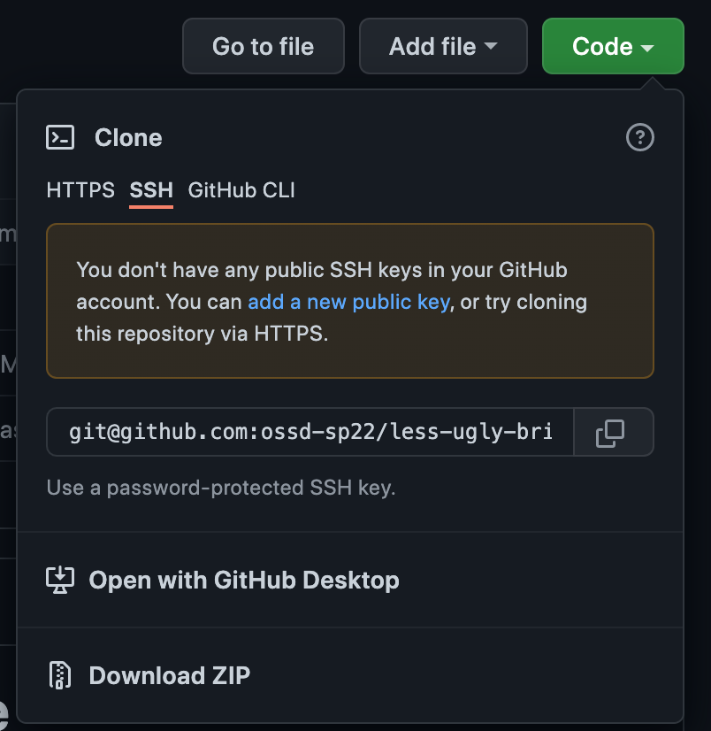

# Less Ugly BrightSpace

## About

We all deserve better looking School Website.
Current BrightSpace is not enough.
The first thing will do is adding an **Dark Mode**.
If any NYU students is interested in making our learning environment aesthically tolerable,
please help yourself and add more features/modes.

> This is one small step for CS students, one giant leap for NYU

## Installation

TBD
In order to properly install less-ugly-brightspace and improve your browsing experience, please follow the following steps:

1. Clone/Download This Reponsitory: Click the code button on your browser. Then either download and unzip it or clone the repository using the provided options.

2. Locate the folder where you donwloaded the files to and type this "about:debugging#/runtime/this-firefox" into your browser to navigate to the extension page.
3. Now Click "Temporary Add on" and select any file within the folder where your copy is located. Now you should be up and running the next time you go on brightspace!

## How to Use

TBD

## Contributing

### Code of Conduct

Our Pledge
In the interest of fostering an open and welcoming environment, we as contributors and maintainers pledge to make participation in our project and our community a harassment-free experience for everyone, regardless of age, body size, disability, ethnicity, sex characteristics, gender identity and expression, level of experience, education, socio-economic status, nationality, personal appearance, race, religion, or sexual identity and orientation.

Our Standards
Examples of behavior that contributes to creating a positive environment include:

Using welcoming and inclusive language
Being respectful of differing viewpoints and experiences
Gracefully accepting constructive criticism
Focusing on what is best for the community
Showing empathy towards other community members
Examples of unacceptable behavior by participants include:

The use of sexualized language or imagery and unwelcome sexual attention or advances
Trolling, insulting/derogatory comments, and personal or political attacks
Public or private harassment
Publishing others’ private information, such as a physical or electronic address, without explicit permission
Other conduct which could reasonably be considered inappropriate in a professional setting
Our Responsibilities
Project maintainers are responsible for clarifying the standards of acceptable behavior and are expected to take appropriate and fair corrective action in response to any instances of unacceptable behavior.

Project maintainers have the right and responsibility to remove, edit, or reject comments, commits, code, wiki edits, issues, and other contributions that are not aligned to this Code of Conduct, or to ban temporarily or permanently any contributor for other behaviors that they deem inappropriate, threatening, offensive, or harmful.

Scope
This Code of Conduct applies within all project spaces, and it also applies when an individual is representing the project or its community in public spaces. Examples of representing a project or community include using an official project e-mail address, posting via an official social media account, or acting as an appointed representative at an online or offline event. Representation of a project may be further defined and clarified by project maintainers.

Enforcement
Instances of abusive, harassing, or otherwise unacceptable behavior may be reported by contacting the project team at [INSERT EMAIL ADDRESS]. All complaints will be reviewed and investigated and will result in a response that is deemed necessary and appropriate to the circumstances. The project team is obligated to maintain confidentiality with regard to the reporter of an incident. Further details of specific enforcement policies may be posted separately.

Project maintainers who do not follow or enforce the Code of Conduct in good faith may face temporary or permanent repercussions as determined by other members of the project’s leadership.

## Style Guide

Color Theme: https://material.io/design/color/dark-theme.html#states
